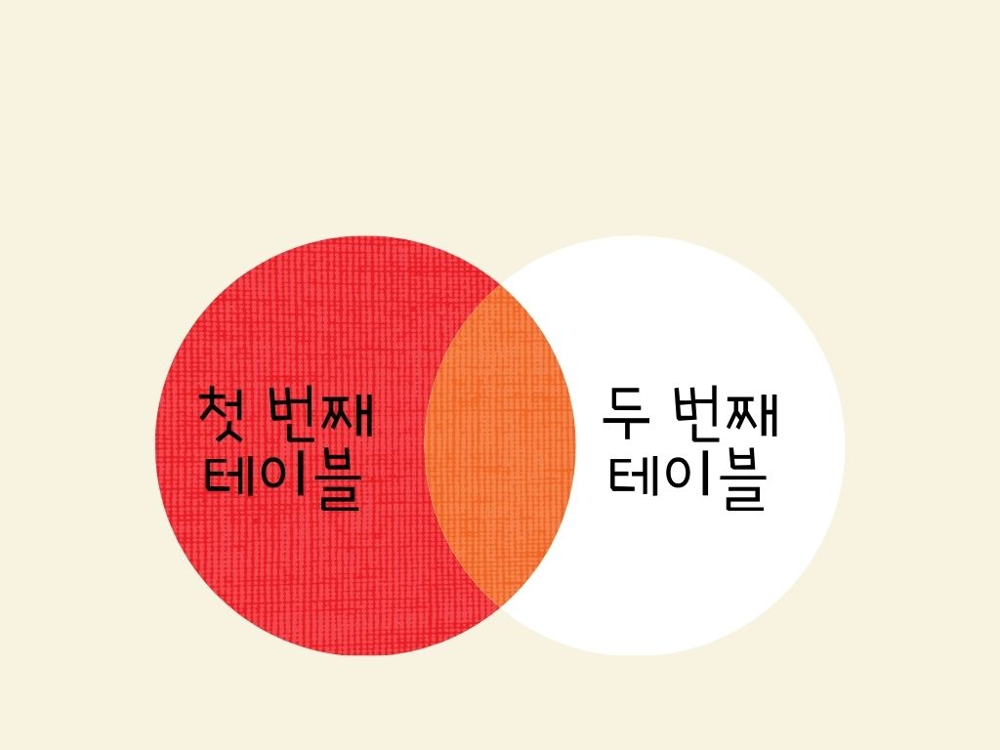

#### LEFT JOIN
LEFT JOIN은 첫 번째 테이블을 기준으로, 두 번째 테이블을 조합하는 JOIN 입니다.

이 때 ON 절의 조건을 만족하지 않는 경우에는 첫 번째 테이블의 필드 값은 그대로 가져 옵니다.
하지만 해당 레코드의 두 번째 테이블의 필드 값은 모두 NULL로 표시 됩니다.

#### 문법
```
첫번째테이블이름
LEFT JOIN 두번째테이블이름
ON 조건
```
#### ON 절에서는 WHERE절에서 사용할 수 있는 모든 조건을 사용 가능 합니다.

#### 예제
Test1 테이블의 Name 필드를 기준으로 Test2 테이블의 Name필드와 일치하는 레코드만을 LEFT로 가져온 후, 그중에서 
ReserveDate 필드의 값이 2016-02-01 이후인 레코드만을 선택하는 예제입니다.

```
SELECT *
FROM Reservation
LEFT JOIN Customer
ON Reservation.Name = Customer.Name
WHERE ReserveDate > '2016-02-01';
```

#### 실행 결과
두 개의 Name 값이 일치하면 INNER JOIN과 같이 두 테이블의 모든 필드를 그대로 가져옵니다. 하지만 두 개의 Name 값이 일치하지 않을 때는 Test2 테이블의 모든 필드를 NULL로 표기됩니다.

#### LEFT JOIN의 결과를 벤 다이어그램 으로 나타낸 것입니다.


