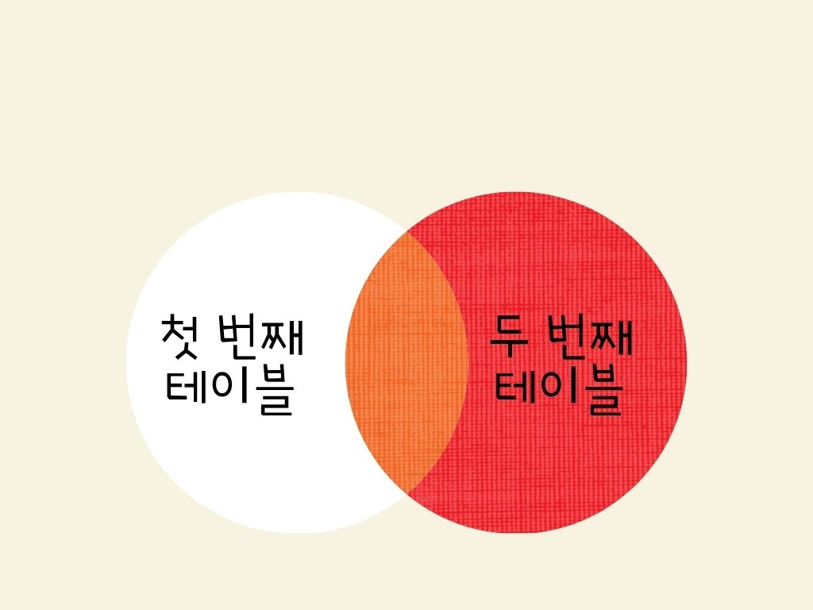

#### RIGHT JOIN
LEFT JOIN과 달리 반대로 두 번째 테이블을 기준으로 첫 번째 테이블을 조합하는 JOIN 입니다.
LEFT JOIN과 같이 ON절의 조건을 만족하지 않을 경우 두 번째 필드의 값을 그대로 가져옵니다. 해당 레코드의 첫 번째 테이블의 필드 값은 모두 NULL로 표시 됩니다.

```
첫번째테이블이름
RIGHT JOIN 두번째테이블이름
ON 조건
```
ON 절에서는 WHERE 절에서 사용할 수 있는 모든 조건을 사용할 수 있습니다.

#### 예제
Test2 테이블의 Name 필드를 기준으로 Test1 테이블의 Name 필드와 일치하는 레코드만을 RIGHT JOIN으로 가져옵니다.

```
SELECT *
FROM Test1
RIGHT JOIN Test2
ON Test1.Name = Test2.Name;
```
두 개의 Name 값이 일치하면 INNER JOIN과 같이 두 테이블의 모든 필드를 그대로 가져옵니다.
하지만 두 개의 Name 값이 일치하지 않는 경우에는 Test1 테이블의 모든 필드를 NULL로 표기합니다.

#### RIGHT JOIN의 결과를 벤 다이어 그램으로 나타낸것

